# Stellar trash

This is the main repository for our START Hack challenge. It is divided into ### sections.

## Code

The repository with the code is available at https://github.com/Ubax/bulk-waste-calculator. It includes instructions how to setup the environment and build the final website. There is also basic description of code, future improvement ideas and instructions for implementing changes.

The website can be tested at https://ubax.github.io/stellar-trash/

## Our solution

Our solution consist of four subsystems working together to provide full solution.

**Calculator** is already implemented part, that can be easily embedded into any existing website. It lets users estimate the number of stamps needed for their waste in a quick and efficient way.

**Payment system** will be an easy to use platform to buy digital stamps. Based on the previous calculations it will

**Offers listing** will be a website to check all the working objects that people want to throw away. It will present the address and the date for pickup.

**Collector application** will be mobile application used by the collectors to validate the digital stamps.

## State diagram of customer actions in the system

## State diagram of trash collector actions in the system

```mermaid
stateDiagram-v2
    state stamp <<choice>>
    state method <<choice>>
    state prompt <<choice>>
    state valid <<choice>>
    
    SeesTrash: Sees trash
    Reports: Reports illegal waste
    Collects: Collects trash
    SelectsTick: Presses ✅ on tablet
    TypesNumber: Types number
    
    [*] --> SeesTrash
    SeesTrash --> stamp
    stamp --> method: Has stamp
    method --> Collects: Physical stamp
    method --> prompt: Digital stamp (number)
    prompt --> SelectsTick: Number visible on tablet
    SelectsTick --> Collects
    prompt --> TypesNumber
    TypesNumber --> valid
    valid --> Collects: Number is valid
    valid --> Reports: Number is invalid
    stamp --> Reports: Doesn't have stamp
```

## State diagram of used item collector actions in the system

